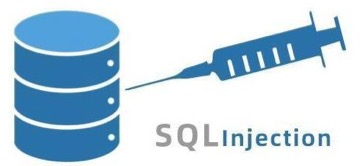
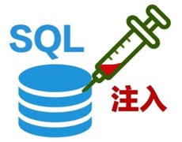

# SQL注入

* `SQL注入`=`SQLi`=`SQL Injection`
  * 攻
    * `SQL注入攻击`
  * 形象的图
    * 
    * 
  * 手段：插入SQL代码
  * 目的：获取到敏感信息
    * 用于：后续的各种操作
      * 编辑、删除、插入等
  * 根据范围，可分为3个层级
    * `Inband`
      * 注入代码和输出代码同渠道
        * 输出的数据直接显示在Web页面中
    * `Out-of-band`
      * 注入代码和输出代码不同渠道
        * 举例
          * 输出数据是邮件发送的
    * `Inferential or Blind`
      * 没有数据输出
        * 攻击者（测试者）可以发送特定查询代码，查看服务器状态（是否符合预期）
  * 常见SQL注入可利用的相关漏洞或弱点
    * `Operator union`：用`SELECT`期间，把2个操作合并成一个
    * `Boolean`：用布尔变量测试某条件是否为真
    * `Error based`：强制服务器产生错误
      * 用于攻击者了解情况后，细化和优化攻击方向
    * `Out-of-band`：攻击产生数据通过其他渠道发送出去
      * 比如
        * 通过HTTP发送请求的方式吧数据传出去
    * `Time delay`：从数据库中使用命令（比如`sleep`）去延迟查询条件
      * 当攻击者没有特定类型的响应（结果、输出、错误等）时
  * 检测SQL弱点
    * 举例
      * `' / ' = ' / ' OR 1 = 1 / 'OR a = a / ' OR ' / ' OR '' = '' / 'OR' = '' / 'OR' = " / 'OR' = ' / ' OR '' = ' / ' OR '=' ' / ' OR '=' '`
  * SQL注入攻击
    * 举例
      * `http:/mywebsite/toto/connexion.php?username=admin'#&password=test`
        * 其中的`#`允许给一行加注释
          * 如果需要编码，编码后是`%23`
        * 此命令实现了：连接到一个管理员账户，而无需（知道）密码
      * `' UNION SELECT username,password FROM users--`
        * 此命令可以显示用户名和密码
  * 相关工具
    * `SQLmap`

