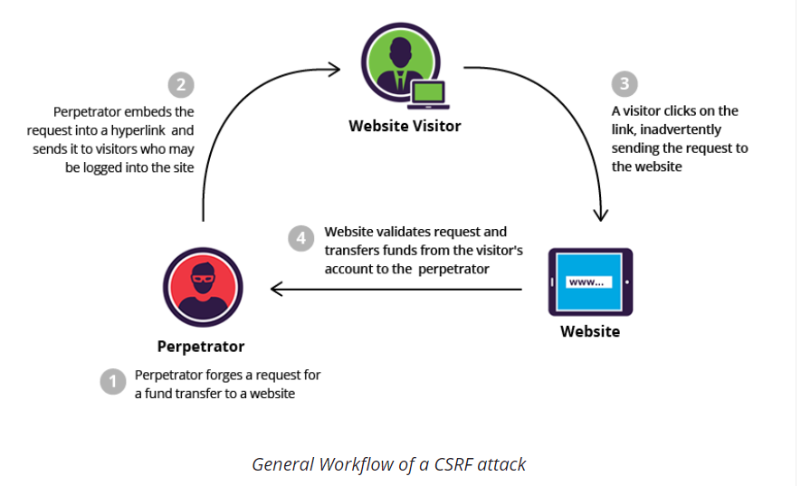

# CSRF跨站请求伪造

* CSRF
  * 名称
    * `CSRF`=`Cross-Site Request Forger`=`跨站请求伪造`
    * 缩写：
      * `CSRF`
      * `XSRF`
    * 又称：`One Click Attack`=`Session Riding`
  * 含义：一种对网站的恶意利用
    * 攻击者盗用了你的身份，以你的名义进行某些非法操作
      * CSRF能够使用你的账户发送邮件，获取你的敏感信息，甚至盗走你的账户
  * 说明
    * 听起来像跨站脚本（XSS），但它与XSS非常不同，并且攻击方式几乎相左
      * `XSS`利用**站点**内的**受信任用户**
      * `CSRF`则通过`伪装`来自**受信任用户**的请求来利用受信任的网站
        * 与XSS攻击相比，CSRF攻击往往不大流行（因此对其进行防范的资源也相当稀少）和难以防范，所以被认为比XSS更具危险性
  * 扫描是否存在CSRF漏洞
    * 自动化扫描工具
      * `netspark`
      * `AWVS`
      * `appscan`
    * 半自动检测工具
      * `CSRFTester`
  * CSRF典型攻击流程
    * 
  * CSRF攻击代码举例
    * `http://bank.com/transfer.do?acct=MARIA&amount=100000`
    * `<a href="http://bank.com/transfer.do?acct=MARIA&amount=100000">View my Pictures!</a>`
    * ``

