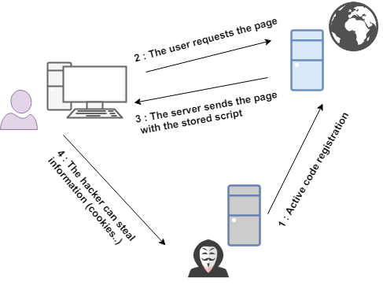
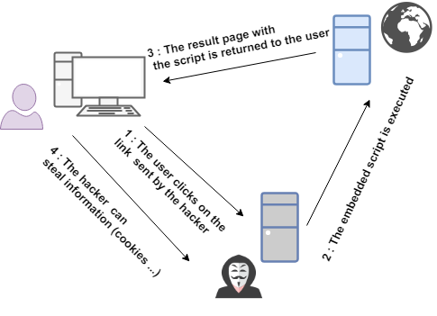

# XSS跨站脚本

* XSS
  * `XSS`=`Cross-Site Scripting`=`跨站脚本` -> `跨站脚本攻击` = `跨站攻击`
    * 为何缩写成XSS而不是CSS？
      * 已有缩写`CSS`
        * 表示网页领域的：`CSS`=`层叠样式表`=`Cascading Style Sheets`
      * 所以改用`XSS`
      * 其中`X`表示`Cross`=`交叉`的含义
  * 是什么：网站应用程序的安全漏洞攻击手段之一
    * 攻击者通过在目标网站上注入(恶意)脚本，使之在用户的浏览器上运行，从而引发潜在风险
      * 利用这些恶意脚本，攻击者可获取用户的敏感信息如 Cookie、SessionID 等，进而危害数据安全
  * 攻击类型：`代码注入类`
  * 本质
    * 恶意代码未经过滤，与网站正常的代码混在一起
      * 浏览器无法分辨哪些脚本是可信的，导致恶意脚本被执行
  * 原理
    * 利用网页开发时留下的漏洞
    * 通过巧妙的方法注入恶意指令代码到网页
      * 恶意指令的语言
        * 常是：`JavaScript`
        * 其他
          * Java
          * VBScript
          * ActiveX
          * Flash
          * HTML
    * 使用户加载并执行攻击者恶意制造的网页程序
  * 攻击策略
    * 在部分情况下，由于输入的限制，注入的恶意脚本比较短
    * 但可以通过引入外部的脚本，并由浏览器执行，来完成比较复杂的攻击策略
  * （恶意代码）注入来源
    * 来自用户的 UGC 信息
    * 来自第三方的链接
    * URL 参数
    * POST 参数
    * Referer （可能来自不可信的来源）
    * Cookie （可能来自其他子域注入）
  * 攻击类型
    * 按攻击来源分
      * 存储型=`Stored XSS`：经过后端，经过数据库
        * 典型流程
          * 
      * 反射型=`Refleted XSS`：经过后端，不经过数据库
        * 典型流程
          * 
      * DOM型=`DOM-based XSS`：经过前端，不经过后端
        * 基于`DOM`=`Document Objeet Model`=`文档对象模型`的一种漏洞
          * `DOM - xss`是通过url传入参数去控制触发的
    * 按是否持久分
      * `非持久型xss攻击`
        * 顾名思义，非持久型xss攻击是一次性的，仅对当次的页面访问产生影响。非持久型xss攻击要求用户访问一个被攻击者篡改后的链接，用户访问该链接时，被植入的攻击脚本被用户游览器执行，从而达到攻击目的
      * `持久型xss攻击`
        * 持久型xss，会把攻击者的数据存储在服务器端，攻击行为将伴随着攻击数据一直存在
  * 结果 效果
    * 获取到
      * 更高权限
        * 提权
          * 利用植入Flash，通过crossdomain权限设置进一步获取更高权限
      * 私密网页内容
      * 会话
      * Cookie
        * 盗用cookie，获取敏感信息
    * 攻击
      * 利用以获取的用户信息冒充用户向网站发起攻击者定义的请求
        * 举例
          * 利用可被攻击的域受到其他域信任的特点，以受信任来源的身份请求一些平时不允许的操作，如进行不当的投票活动
          * 利用iframe、frame、XMLHttpRequest或上述Flash等方式，以（被攻击）用户的身份执行一些管理动作，或执行一些一般的如发微博、加好友、发私信等操作
          * 在访问量极大的一些页面上的XSS可以攻击一些小型网站，实现DoS攻击的效果
  * 防护手段
    * 后端（开发期间）
      * HTML 转义 = 过滤特殊字符
      * 使用HTTP头指定类型
  * XSS举例=代码注入举例
    * `JS`：``
    * `HTML`：`<b>if this text is bold, the site is potentially vulnerable</b>`
    * `CSS`：``
  * XSS相关工具
    * `ZAP`=`Zed Attack Proxy`
    * `XSS Scanner`
