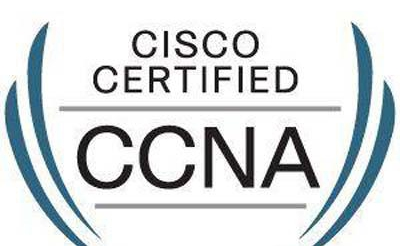
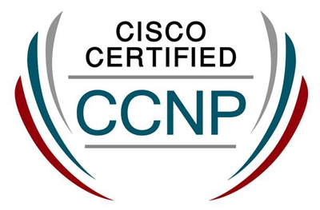

# 网络证书

## `CCIE`=`思科认证互联网专家`

* `CCIE`=`思科认证互联网专家`
  * 概述：美国Cisco公司于1993年开始推出的专家级认证考试，被全球公认为IT业最权威的认证
  * 作用：证书持有者被认为是具有专业网络技术知识和丰富工作经验的最好证明
  * 证书
    * 
  * 认证领域：6个
    * 路由和交换认证
    * 服务提供商认证
    * 安全认证
    * 协作认证
    * 数据中心认证
    * 无线认证

## `CCNA`=`思科认证网络工程师`

* `CCNA`=`思科认证网络工程师`
  * 概述
    * 最初关注的是路由和交换，但近年来又围绕安全、云计算、协作、安全操作、设计、数据中心技术、工厂、服务提供商和无线等领域又增加了新的证书
  * 证书长什么样
    * 
  * 有效期
    * CCNA证书的有效期为3年
      * 3年之后需要参加再认证（Recertification）的考试
      * 如果你在这3年时间内考取了更高级别的思科认证，则CCNA认证的有效期自动更新
  * 现状
    * 根据Global Knowledge数据，2019年北美思科证书持有者的平均工资为101533美元
    * 数据显示，2019年16%的IT从业人员持有思科认证，其中CCNA路由和交换最为常见。
    * 在通过CCNA认证的员工中，71％持有CCNA路由和交换证书，18％的员工持有CCNA安全证书

## `CCNP`=`思科认证网络专家`

* `CCNP`=`思科认证网络专家`
  * 概述
    * 获得CCNP认证的专业人员可以为具有100到500多个节点的大型企业网络安装、配置和运行LAN、WAN和拨号访问业务。从2015年1月29日起，CCNP考试科目启用新的CCNP考试政策
  * 证书长什么样
    * 
  * 现状
    * CCNP路由和交换是思科认证中第二大最常见的认证，通过认证的员工中有33％都持有该证书
    * Global Knowledge发现，到2020年，CCNP路由和交换证书持有者的平均工资将达到119178美元，他们最有可能成为网络工程师或分析师
    * 思科于2020年2月23日发布了新的认证框架，其中CCNP Enterprise取代了CCNP路由和交换。所有新的CCNP认证都要求考生通过两项考试：一项核心考试和一项技术领域的集中考试

