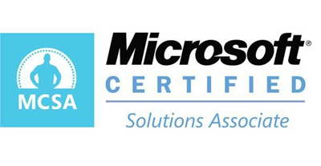

# 其他证书

## `CISA`=`国际信息系统审计师`

* `CISA`=`国际信息系统审计师`
  * 概述
    * 由信息系统审计与控制协会ISACA发起
    * 始于1978年
    * 已经成为涵盖信息系统审计、控制与安全等专业领域的全球公认的标准
  * 证书长什么样
    * 
  * CISA考试领域
    * 信息系统的审计流程（占21%）
    * IT治理和管理（占17%）
    * 信息系统的购置、开发和实施（占12%）；
    * 信息系统的运营和业务恢复能力（占23%）
    * 信息资产的保护（占27%）
  * 现状
    * 据Global Knowledge预计，到2020年，CISA证书持有者的平均收入将达到132278美元
    * Global Knowledge发现，证书持有者的平均年龄为46.9岁，从事IT审计工作，通常持有3.3个证书

## `CDP`=`Certified Data Professional`=`数据专业认证`

* `CDP`=`Certified Data Professional`=`数据专业认证`
  * 2015年诞生的一项认证
    * 取代了2004年至2015年由计算机专业技术认证机构（ICCP）提供的数据管理专业认证（CDMP）
  * 证书长什么样
    * 
  * CDP的专业证书领域
    * 业务分析
    * 数据管理
    * 数据仓库
    * 信息系统管理
  * 其他说明
    * 想要获得CDP证书需要参加为期四天的数据管理现场研讨会，并通过书面考试。证书持有者必须通过90分钟的IS（信息系统）核心考试、90分钟的业务核心和数据管理考试以及其他专业化考试
    * 超过一半的CDP证书持有者拥有至少10年的行业经验，四分之一的人有6至10年的行业经验，只有不到22％的人工作经验在6年以下

## `CompTIA A +`

* `CompTIA A +`
  * 概述
    * CompTIA A +认证代表着计算机技术人员的入门级能力，是一个厂商中立的国际认证，涵盖各种技术和操作系统。美国计算机行业协会 (CompTIA- Computing Technology Industry Association)是在全球ICT领域最具影响力的、最大的、全球领先的行业协会，自1982年成立之日起，一直致力于通过各种标准、专业能力、教育和商业解决方案促进信息技术(ICT)产业及相关从业人员的发展
  * 证书长什么样
    * 
  * 考试
    * 持证人员必须通过两项90分钟的考试
      * 一项涵盖移动设备、网络技术、硬件、虚拟化和云计算和网络故障排除
      * 另一项涵盖安装和配置操作系统、安全、软件故障排除和操作步骤
  * 现状
    * 数据显示，2019年北美CompTIA证书持有者的平均工资为93097美元，其中最受欢迎的CompTIA认证是Security +，A +和Network +

## 微软

### `MCSA`=`微软认证解决方案专员`

* `MCSA`=`微软认证解决方案专员`
  * 概述
    * 为入门级工作者设计，证明他们对微软产品、角色和知识领域的熟练程度
    * MCSA认证是许多微软认证解决方案专家（MCSE）认证的基础，这些认证针对的是经验更丰富的IT工作者
  * 证书长什么样
    * 
  * 解释
    * 微软的认证侧重于用户设计和构建技术解决方案的能力。MCSA认证围绕特定角色和专有产品，例如Microsoft Azure、SQL Server、Office 365、SharePoint Server、Skype for Business、Microsoft Dynamics 365、Exchange Server和Windows Server
  * 现状
    * 2019年IT技能和薪酬调查显示，16％的人持有微软认证，其中19％的微软持证者持有MCSA：Windows Server 2008证书，17％持有MCSA：Windows Server 2012证书

### `MTA`=`微软技术专员认证`

* `MTA`=`微软技术专员认证`
  * 概述
    * 一项入门级认证，可验证Microsoft SQL Server，Visual Studio，Windows和Windows Server 2016的基础技术知识
  * 考试
    * 考试的核心能力范围涵盖80%信息专业知识与20%的技能
  * 证书长什么样
    * 
  * 解释
    * MTA认证涉及很多基本技术概念、评估和验证核心技术知识。对于希望进入技术领域的人来说，这是一个很好的起点
  * 现状
    * 调查显示，2019年北美微软证书持有者的平均工资为104127美元。 MTA考试不具备获得微软认证专家（MCP）的资格，也不是获得MCSA或MCSD认证的先决条件

## Oracle

### `Oracle数据库认证`

* `Oracle数据库认证`
  * 概述
    * Oracle认证代表了你对数据库和Java知识和技能的掌握。Oracle数据库设计和SQL编程教授IT从业人员分析复杂的业务场景，设计和创建数据模型，以及使用SQL创建数据库
  * 证书长什么样
    * 
  * 现状
    * Oracle在数据库设计以及SQL和PL/SQL编程方面侧重于数据的组织、管理和使用。数据显示，2019年北美Oracle数据库认证证书持有者的平均工资为116961美元

## `PMP`=`项目管理专业人士资格认证`

* `PMP`=`项目管理专业人士资格认证`
  * 概述
    * 项目管理专业人士资格认证（PMP）是由美国项目管理协会（Project Management Institute(简称PMI)）发起的，严格评估项目管理人员知识技能是否具有高品质的资格认证考试。在决定谁委托重要的组织项目计划时，证书通常是关键的区分因素
  * 证书长什么样
    * 
  * 条件
    * 想要获得认证的个人必须接受35个小时的PMP相关培训。
    * 此外，没有学士学位的人必须具有7500个小时的项目管理经验，拥有学士学位或更高学位的人则需要4500个小时的项目管理经验
  * 现状
    * 数据显示，2020年PMP证书持有者的平均工资为143493美元
    * PMP认证持有者的平均年龄为48.7岁，通常是项目经理，总共持有4.5项证书
