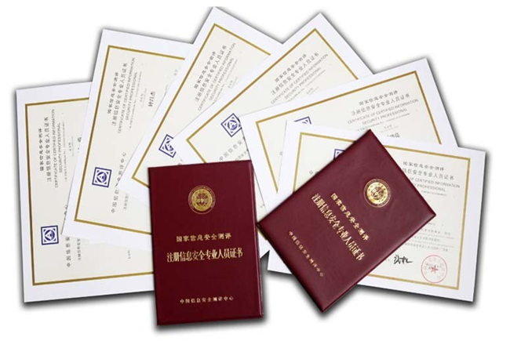
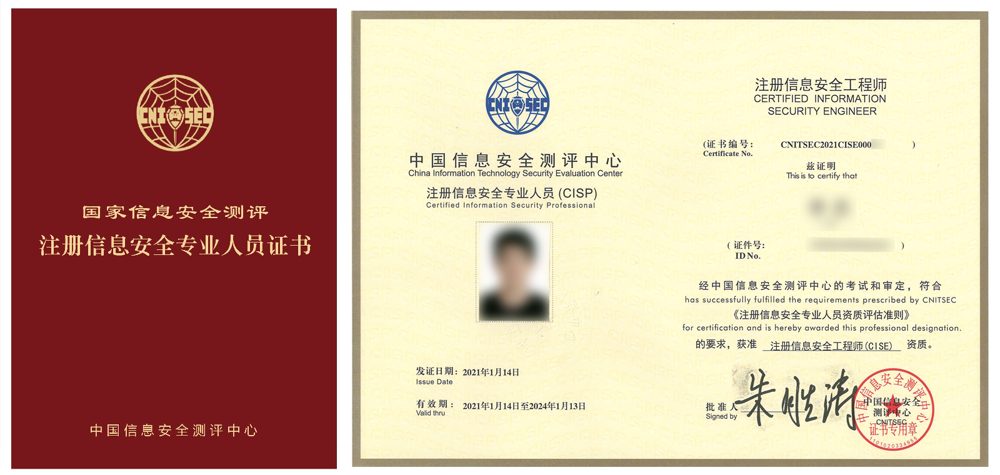
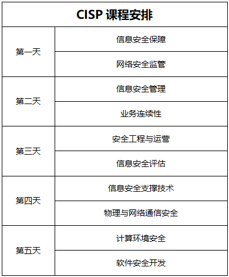

# 安全证书

## 国内

### `CISP`

* `CISP`=`Certified Information Security Professional`=`注册信息安全专业人员`
  * 始于：2004年
  * 证书类型：政府(机构)认证
  * 发证机构：中国信息安全测评中心
    * `CISP`系经`中国信息安全测评中心`实施**国家认证**
  * 证书长什么样
    * 
    * 
  * 考证要求：需要工作经验
  * 考取难度：★★★☆☆
  * 适应类型： 国有企业、政府、军工、8+2行业信息安全主管及为国内提供信息安全服务的安全公司从业人员
  * 费用：
    * 总价：12800元/人
      * 培训费：8800元/人
        * 课程安排
          * 
      * 考试费：4000元/人
        * 包括两次补考费用
          * 也就是说有三次考试机会，再考就每次500考试费
      * 证书维持费用=证书年金=年金
        * 考试成功后第一个3年免年金，从第4年开始缴纳年金
        * CISP/CISM证书有效期为3年，证书维持费用三年一缴
          * CISP人员注册维持费用标准为500元/人/年
          * CISM人员注册维持费用标准为200元/人/年
        * 另，证书维持手续费200元/次
  * 认证要求
    * 注册要求
      * 教育与工作经历
        * 硕士及以上：具有1年工作经历
        * 本科毕业：具有2年工作经历
        * 大专毕业：具有4年工作经历
      * 专业工作经历
        * 至少具备1年从事信息安全有关的工作经历
    * 培训资格
      * 在申请注册前，成功地完成了CNITSEC或其授权培训机构组织的注册信息安全专业人员培训课程相应资质所需的分类课程，并取得培训合格证书
    * 通过由CNITSEC举行的注册信息安全专业人员考试
    * 能力要求
      * 具备一定的信息安全基础知识，了解并掌握`GB/T 18336`、`ISO 15408`、`ISO 17799`等有关信息安全标准，具有进行信息安全服务的能力
  * 认证说明
    * 概述
      * CISP是认证类型总称
        * 
      * 实际上分为四项认证证书
        * `CISE`=`Certified Information Security Engineer`=`注册信息安全工程师`
          * 工程师
        * `CISO`=`Certified Information Security Officer`=`注册信息安全管理人员`
          * 管理员
        * `CISP-A`=`注册信息安全审核员`=`注册信息安全审计师`
          * 审计师
        * `CISD`=`CISP-DRP`=`注册信息安全灾难恢复工程师`
          * 开发人员
      * 面向对象不同，适用面也不同
    * 详解
      * `CISE`/`CISO`
        * 概述：侧重安全技术和安全管理，教材一样，课程一样，同班上课，只是考卷不同而已
        * 详解
          * `CISE`
            * 如果一直干技术工作的，建议选CISE
              * 主要从事信息安全技术领域的工作，具有从事信息系统安全集成、安全技术测试、安全加固和安全运维的基本知识和能力
          * `CISO`
            * 一直干管理或咨询的，建议选CISO
              * 主要从事信息安全管理领域的工作，具有组织信息安全风险评估、信息安全总体规划编制、信息安全策略制度制定和监督落实的基本知识和能力
      * `CISP-A`=`CISP-Audit`
        * 侧重安全审计方面的知识
          * 主要从事信息安全审计工作，在全面掌握信息安全基本知识技能的基础上，具有较强的信息安全风险评估、安全检查实践能力
      * `CISD`
        * 面向软件开发人员，侧重软件安全开发
          * 申请中国信息安全测评中心软件安全开发企业认证绑定的是个证书，所以要申请开发类企业认证的，注意要考的是CISD
          * 主要从事信息系统灾难恢复工作，在全面掌握信息安全基本知识技能的基础上，具有较强的信息系统灾难恢复建设和管理的实践能力
    * 最新情况
      * 近几年该认证体系不断丰富，引入了更多认证：
        * `CISP-CSE`：对应云安全
        * `CISP-BDSA`：大数据安全
        * `CISP-ICSSE`：工控安全
        * `CISP-PTE/PTS`：渗透测试
        * `CISP-IRE`：应急响应
        * `CISP-DSG`：数据治理
        * `CISP-PIP`：个人信息保护
        * `CISP-F`：调查取证
  * 注意
    * CISP为强制培训，也就是说不能直接考试，必须报一个授权培训机构（培训也采取授权制，必须有授权才能培训和考试）接受8天的培训后才能参加考试（2018年起调整为五天）
      * 未来会逐步结合在线学习等，降低培训时间要求
    * 报考时要选择考试类型，根据自己能力和擅长方向选择。不要因为听谁说哪个好考就考哪个

#### `CISAW`=`信息安全保障人员认证`

* `CISAW`=`信息安全保障人员认证`
  * 始于：2011年
  * 发证机构：中国网络安全审查技术与认证中心
    * 原中国信息安全认证中心
    * 是国家市场监督管理总局直属事业单位，同时在业务上接受中央网信办的指导
  * 三大等级
    * 预备认证
    * 资格认证
      * 基础级
    * 专业认证
      * 专业级
      * 专业高级
  * 专业认证子类
    * 安全集成
    * 风险管理
    * 应急服务
    * 安全软件
    * 安全运维
    * 电子政务
    * 电子数据取证
    * 网络攻防
    * 网络情报分析
    * WEB安全
    * 工控网络安全
    * 网络舆情分析与处置

#### `CCSRP`=`网络与信息安全应急人员认证`

* `CCSRP`=`网络与信息安全应急人员认证`
  * 始于：2017年
  * 发证机构：国家计算机网络应急技术处理协调中心
    * 简称：国家互联网应急中心
    * 是中共中央网络安全和信息化委员会办公室（以下简称中央网信办）的直属事业单位
  * 两大类认证
    * 通用信息安全人员认证
      * 方向
        * 管理
        * 技术
      * 每个方向设置不同的等级
    * 面向行业的人员认证
      * 不同行业
        * 通信
        * 电力
        * 石油炼化
        * 轨道交通
      * 能够兼顾不同行业的安全技能要求的差异性

## 国外

### `CISSP`=`信息系统安全专业认证`

* `CISSP`=`信息系统安全专业认证`
  * 证书类型：行业认证
  * 发证机构：`ISC`
    * `ISC`=`国际信息系统安全认证协会`=`Internationa Information Systems Security Cerification Consortium`
  * 考证要求：需要工作经验
  * 考取难度：★★★★☆
    * 比CISP难度多一星
      * 因为英语和6小时的考试时间，比较摧残人
  * 适应类型：外企、涉外服务、大型企业（包括国有企业，有不少国企也比较认CISSP）如银行等信息安全主管和信息安全从业者
  * 费用：
    * 培训：不强制 -> 无需培训也可直接考试
      * 国内很多培训公司都提供
    * 考试：考试费 599美元
      * 这是一次考试的费用，如果没通过，下次还要交考试费
  * 证书
    * 
  * 作用：代表国际信息系统安全从业人员的权威认证
  * 认证对象
    * 面向从事商业环境安全体系建构、设计、管理或控制的专业人员
      * 对从业人员的技术及知识积累进行测试
  * `ISC`共有9项认证
    * `CISSP`=`注册信息系统安全师`
    * 8个延伸出来的系列认证
      * `CSSLP`=`注册软件生命周期安全师`
      * `CCFPSM`=`注册网络取证师`
      * `CAP`=`注册信息安全许可师`
      * `SSCP`=`注册系统安全员`
      * `HCISPPSM`=`医疗信息与隐私安全员`
      * CISSP专项加强认证
        * `CISSP-ISSAP`=`Information Systems Security Architecture Professional`=`信息系统安全架构专家`
        * `CISSP-ISSEP`=`Information Systems Security Engineering Professional`=`信息系统安全工程专家`
        * `CISSP-ISSMP`=`Information System Security Management Professional`=`信息系统安全管理专家`
  * 考试内容=领域：8个
    * 安全和风险管理
    * 资产安全
    * 安全架构和安全模型
    * 通信和网络安全
    * 身份和访问管理
    * 安全评估和测试
    * 安全操作
    * 软件开发安全
  * 要求
    * 在两个或两个以上CISSP领域有五年相关工作经验
  * 现状
    * 根据Global Knowledge的数据
      * 到2020年，持证人员的平均工资为141452美元
      * CISSP证书持有者
        * 平均年龄为48.1岁
        * 从事安全工程师或分析师工作
        * 普遍拥有6.1项证书
  * 评价
    * CISSP因为推出比较早，所以相对比较知名
      * 目前认证中也就CISSP因为资格老，比较多人知道，所以考的较多，其他的嘛，屈指可数
    * CISSP考试相对难些
      * CISSP考试难点在于两个地方，一是英文考试，二是考试时间。
        * 考题
          * 考卷250道题，其中50道是不计分的（哪50道题都不知道）
        * 考试时间
          * 6小时，也就是360分钟
          * 平均不到一分半要答一道题
            * 中间还需要上厕所，吃东西，所以每道题时间就一分钟多
        * 英文
          * 对英语的要求不是一点半点的高
          * 后来改成中英文都有
            * 愿意看中文的看中文，不愿意看中文的看英文
          * 不过根据之前参加考试的反馈，中文题翻译的质量实在不咋的，很多人题都读不懂，还不如用英文
          * 并且六个小时的考试，大脑高度紧张，压力是真不小的

## 安全证书对比

### `CISP` vs `CISSP`

* `CISP` vs `CISSP`
  * 相同点
    * `CISP`和`CISSP`：都是偏重信息安全管理的 = 信息安全类认证
       * 技术知识讲的宽泛且浅显，考试都是一带而过 = 特点：一英里宽一英寸深
         * 这两个认证证明持证人员对信息安全知识了解比较全面
       * 两者没本质区别
         * CISSP从2011年就开始谋求在中国与CISP互认，互认的备忘录都签了
         * 当时双方还做了知识体系的对比，知识体系没太多差别，基本都是一致的
         * 主要差别在法律法规上。所以双方没有本质区别
   * 不同点
    * `CISSP`
        * 要求持证人员的信息安全工作经验都要5年以上
        * 特点
          * 由于`CISSP`推出时间较早，目前已经国际化运作，因此被称为**国际认证**
    * `CISP`
        * 要求大专学历4年以上工作经验
        * 特点
          * `CISP`是中国信息安全测评中心推出，有**政府**背景给认证做**背书**
