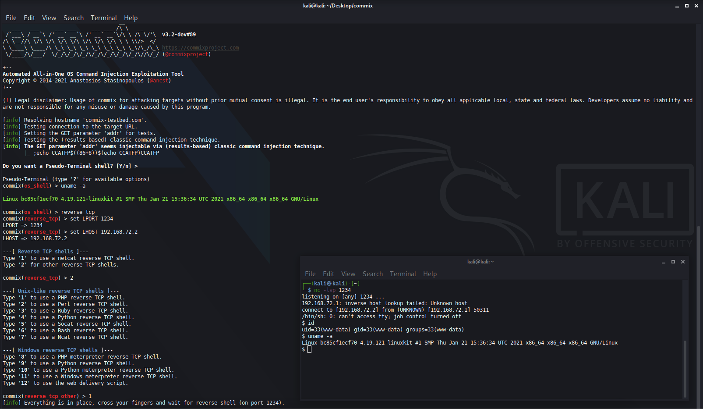

# Commix

* `Commix`
  * 一句话描述：Commix (short for [comm]and [i]njection e[x]ploiter) is an open source penetration testing tool, written by Anastasios Stasinopoulos (@ancst), that automates the detection and exploitation of command injection vulnerabilities.
  * 主页
    * Kali Linux
      * https://tools.kali.org/exploitation-tools/commix
        * Commix (short for [comm]and [i]njection e[x]ploiter) has a simple environment and it can be used, from web developers, penetration testers or even security researchers to test web applications with the view to find bugs, errors or vulnerabilities related to command injection attacks. By using this tool, it is very easy to find and exploit a command injection vulnerability in a certain vulnerable parameter or string. Commix is written in Python programming language
    * Github
      * Automated All-in-One OS Command Injection Exploitation Tool
        * https://github.com/commixproject/commix
    * gitlab
      * https://gitlab.com/kalilinux/packages/commix
  * 截图
    * 
