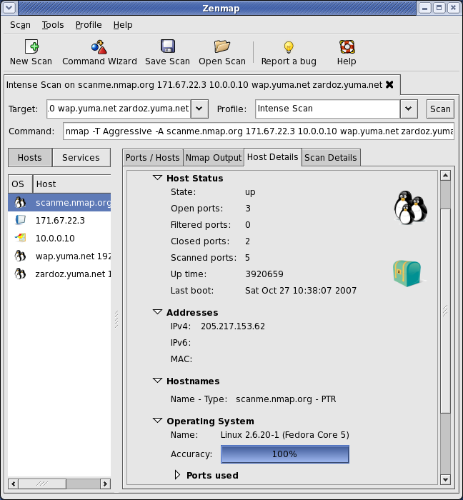
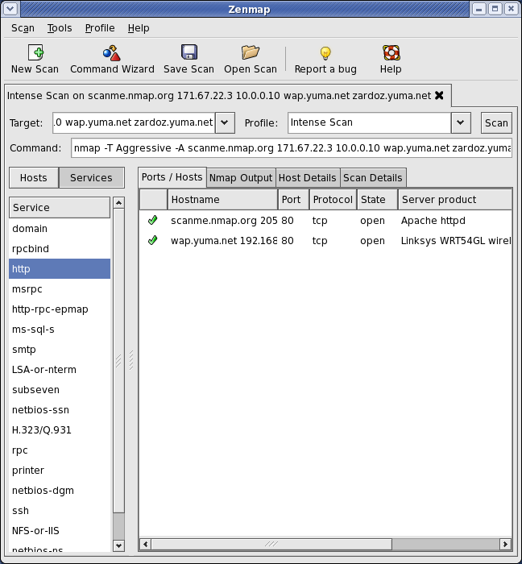

# Zenmap

* `Zenmap`
  * 一句话描述：nmap的GUI版
    * 在nmap基础上包了一个可视化的皮
    * 底层功能都是一样的，都是nmap的功能
  * 概述
    * 最好用的免费网络安全工具之一，通过GUI使所有Nmap（network mapper,用于网络发现和安全审计）功能更易于实现。为初学者设计，同时为Nmap老兵提供高级功能。Zenmap将保存常用的扫描配置文件作为模板，从而方便扫描设置。扫描结果可以通过一个可搜索的数据库保存，以便跨时间对比分析
  * 图
    * 
    * 
    * 
    * 
