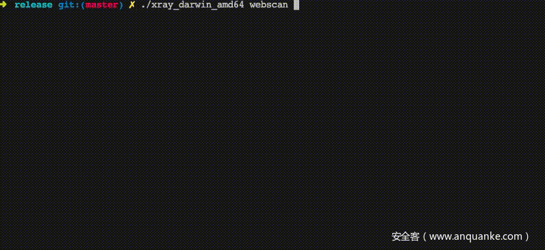

# Xray

* `Xray`
  * 是什么：Xray是一款功能强大的漏洞扫描工具
  * 特点
    * 检测速度快
      * 发包速度快，漏洞检测算法高效
    * 支持范围广
      * 大至 OWASP Top 10 通用漏洞检测，小至各种 CMS 框架 POC，均可以支持
    * 编写代码的人员素质高, 通过 Code Review、单元测试、集成测试等多层验证来提高代码可靠性
  * 详解
    * `xray`是从长亭洞鉴核心引擎中提取出的社区版漏洞扫描神器，支持主动、被动多种扫描方式，自备盲打平台、可以灵活定义 POC，功能丰富，调用简单，支持 Windows / macOS / Linux 多种操作系统，可以满足广大安全从业者的自动化 Web 漏洞探测需求。
    * Xray支持的漏洞检测类型包括XSS漏洞检测 (key: xss)、SQL 注入检测 (key: sqldet)、命令/代码注入检测 (key: cmd-injection)、目录枚举 (key: dirscan)、路径穿越检测 (key: path-traversal)、XML 实体注入检测 (key: xxe)、文件上传检测 (key: upload)、弱口令检测 (key: brute-force)、jsonp 检测 (key: jsonp)、ssrf 检测 (key: ssrf)、基线检查 (key: baseline)、任意跳转检测 (key: redirect)、CRLF 注入 (key: crlf-injection)、Struts2 系列漏洞检测 (高级版key: struts)、Thinkphp系列漏洞检测 (高级版key: thinkphp)、POC 框架 (key: phantasm)。
  * 评价
    * Xray是一款基于Go语言开发的漏洞扫描器，支持导入poc扫描，不过团队对poc的质量要求很高，导致现在poc数量比较少
  * 截图
    * 
  * 资料
    * 官网
      * https://xray.cool/
    * GitHub
      * https://github.com/chaitin/xray
